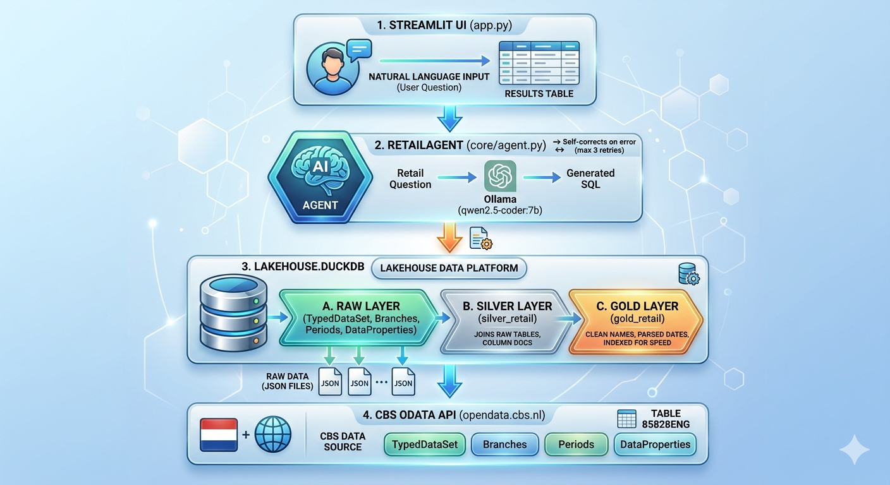

# NL-AI Retail Lakehouse App

A natural-language analytics app for Dutch retail trade statistics. It fetches live data from the CBS (Statistics Netherlands) OData API, stores it in a local DuckDB lakehouse (bronze → silver → gold), and lets you query it in plain English via an Ollama-powered AI agent inside a Streamlit UI.

---

## Features

- Automated ingestion from the CBS OData API (Table 85828ENG — Dutch Retail Trade)
- Three-layer lakehouse architecture in a single DuckDB file
- AI agent (Ollama + `qwen2.5-coder:7b`) translates natural language to DuckDB SQL with self-correction retries
- Streamlit chat UI — first run builds the database automatically

---

## System Requirements

| Component | Minimum | Recommended |
|-----------|---------|-------------|
| Python | 3.14 | 3.14+ |
| RAM | 8 GB | 16 GB (model runs in memory) |
| Disk space | 6 GB | 10 GB (Ollama model ~4 GB) |
| OS | macOS / Linux | macOS / Linux |
| Ollama | installed + server running | latest |

> The `qwen2.5-coder:7b` model requires ~6 GB of disk and loads ~4–5 GB into RAM at runtime.

---

## Architecture




### Layer Details

| Layer | Table | Description |
|-------|-------|-------------|
| bronze | `bronze_TypedDataSet` | bronze turnover records from CBS |
| bronze | `bronze_Branches` | Industry/branch lookup |
| bronze | `bronze_Periods` | Time period lookup |
| bronze | `bronze_DataProperties` | Column metadata / descriptions |
| Silver | `silver_retail` | Joined dataset with human-readable branch/period names and column comments |
| Gold | `gold_retail` | Analytics-ready: clean column names, parsed `observation_date`, indexed on date and industry |

---

## Project Structure

```
NL-AI-Retail-Lakehouse-App/
├── retail_lakehouse/
│   ├── __init__.py
│   ├── cbs_to_lakehouse.py   # Orchestrator: ingestion -> bronze -> silver -> gold
│   ├── config.yaml           # CBS table_id and endpoint config
│   ├── app/
│   │   └── app.py            # Streamlit UI: chat interface + pipeline trigger
│   ├── core/
│   │   ├── __init__.py
│   │   └── agent.py          # RetailAgent: NL query -> DuckDB via Ollama
│   ├── data/
│   │   ├── Branches.json
│   │   ├── DataProperties.json
│   │   ├── Periods.json
│   │   ├── TypedDataSet.json
│   │   └── duckdb/
│   │       ├── lakehouse.duckdb
│   │       └── queries/
│   │           ├── bronze.sql
│   │           ├── silver.sql
│   │           └── gold.sql
│   ├── database/
│   │   ├── __init__.py
│   │   └── database.py
│   └── ingestion/
│       ├── __init__.py
│       └── cbs_api_extract.py
├── setup.sh
├── CLAUDE.md
├── poetry.lock
└── pyproject.toml
```

---

## Prerequisites

- [Ollama](https://ollama.com/download) installed and server running (`ollama serve`)
- Internet access (CBS API + Ollama model download on first run)
- Python 3.14+

---

## Quick Start

```bash
# Clone the repo
git clone https://github.com/vishnuvarthan19/NL-AI-Retail-Lakehouse-App.git
cd NL-AI-Retail-Lakehouse-App

# Run setup (installs Poetry if missing, pulls model, launches app)
./setup.sh
```

On first launch the app will:
1. Fetch all CBS retail data from the API
2. Build the bronze, silver, and gold layers in DuckDB
3. Open the chat UI in your browser

---

## Manual Steps

If you prefer to run each step yourself:

```bash
# Install Poetry
curl -sSL https://install.python-poetry.org | python3 -

# Install dependencies
poetry install

# Pull the Ollama model
ollama pull qwen2.5-coder:7b

# Run the data pipeline manually (optional — app does this on first run)
poetry run python -m retail_lakehouse.cbs_to_lakehouse

# Launch the app
poetry run streamlit run retail_lakehouse/app/app.py
```

---

## Using a Different Model

The model is configured in `retail_lakehouse/config.yaml` — no code changes needed.

**1. Pull the model you want:**
```bash
ollama pull <model-name>
# e.g.
ollama pull codellama:7b
ollama pull llama3.1:8b
ollama pull deepseek-coder:6.7b
```

**2. Update `config.yaml`:**
```yaml
agent:
  model: "codellama:7b"
  max_retries: 3
```

Restart the app and it will use the new model. Browse available models at [ollama.com/library](https://ollama.com/library). Models with coding ability (`coder`, `deepseek-coder`, `codellama`) produce the most reliable SQL.

---

## Example Questions

- "Which 5 industries had the highest turnover growth last month?"
- "Show me the monthly trend for supermarkets in 2023"
- "Which sector had the lowest calendar-adjusted turnover index this year?"

---

## Data Source

**CBS Statline — Table 85828ENG**
Dutch Retail Trade: Turnover, Volume, and Index figures
- Publisher: Statistics Netherlands (CBS)
- API: `https://opendata.cbs.nl/ODataFeed/odata/85828ENG`
- Update frequency: Monthly (with ~2 month lag)
- License: CC BY 4.0

---

## Dependencies

| Package | Purpose |
|---------|---------|
| `duckdb` | Embedded analytical database (all lakehouse layers) |
| `ollama` | Local LLM inference for NL → SQL |
| `streamlit` | Web UI |
| `requests` | CBS OData API calls |
| `pyyaml` | Config parsing |
